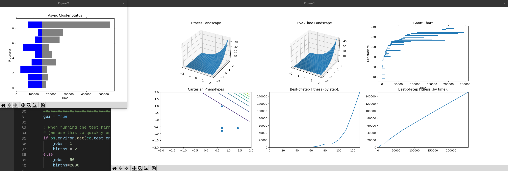

# Avoiding Excess Computation in Asynchronous Evolutionary Algorithms

This repo contains code for part of the experiments described in our 2022 paper,

 - Eric O. Scott, Mark Coletti, Catherine D. Schuman, Bill Kay, Shruti R. Kulkarni, Maryma Parsa, Cathika Gunaratne, and Kenneth A. De Jong.  "Avoiding Excess Computation in Asynchronous Evolutionary Algorithms," _Expert Systems_ (Wiley), 2022.

The project consists of a Python module, `async_sim.components`, which provides objects that are composed
into experiment applications found under `examples`.

Our algorithms are built atop v0.7dev of the [LEAP library](https://leap-gmu.readthedocs.io/) (see `leap_ec` [on PyPI](https://pypi.org/project/leap-ec/)).

The scripts here will generate live telemetry plots (these differ from the plots in the paper, which were computed offline from the outputted CSV data):




## Setup

Optionally set up a virtual environment (ex. via `python -m venv ./venv && source venv/bin/activate`).

Then install the package:

```bash
pip install -e .
```

Ensure the tests pass:

```bash
pip install pytest
pytest
```

## Run Experiments

```bash
python examples/async_simulation.py
python examples/takeover_times.py
```
